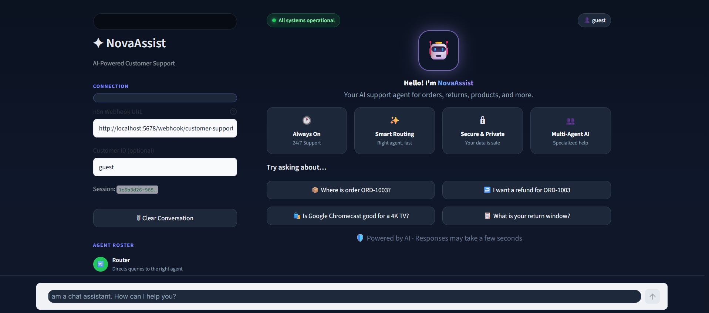
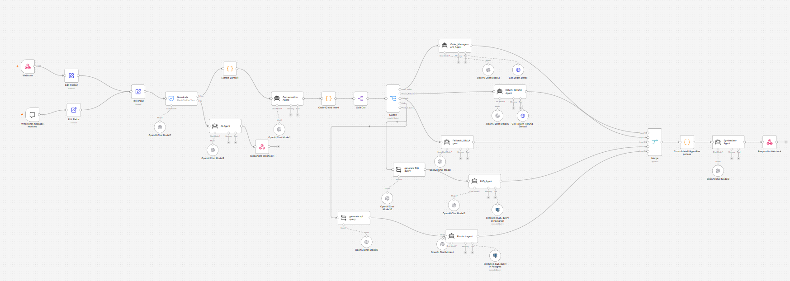
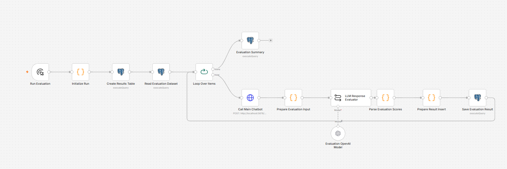

# 🤖 Multi-Agent AI Customer Support Chatbot

A **production-inspired multi-agent AI customer support Chatbot** built with **Python, FastAPI, Streamlit, n8n, Retrieval-Augmented Generation (RAG), PostgreSQL/Supabase, vector search, and OpenAI LLMs**.

The system receives customer queries through a Streamlit chatbot, identifies user intent, dynamically routes requests to specialized AI agents, retrieves relevant information from APIs and knowledge bases, and generates a consolidated customer-friendly response.

The project demonstrates practical implementation of **Agentic AI, multi-agent orchestration, RAG, structured LLM outputs, API integration, guardrails, context handling, response synthesis, and automated LLM evaluation**.

---

## 📸 Demo

### Streamlit Customer Support Chatbot



### Multi-Agent n8n Workflow



### Automated LLM Evaluation Workflow



---

## 🚀 Project Overview

Modern customer-support queries often require information from multiple systems.

For example:

> "Where is my order ORD1001 and what is your return policy?"

Instead of relying on a single LLM prompt, this system uses a **multi-agent architecture** in which an orchestration layer analyzes the customer query and dynamically routes it to the appropriate specialist agents.

The individual agents retrieve relevant information from APIs, structured data sources, and vector-based knowledge bases.

When multiple agents are required, their outputs are consolidated by a response-synthesis layer before the final answer is returned to the customer.

---

## ✨ Key Features

* Multi-agent customer-support architecture
* LLM-based intent classification
* Dynamic agent routing
* Multi-intent query handling
* Retrieval-Augmented Generation (RAG)
* Semantic/vector retrieval
* Product-information retrieval
* FAQ knowledge-base retrieval
* Order tracking through REST APIs
* Return and refund handling
* LLM guardrails
* Structured LLM outputs
* Conversation context handling
* Multi-agent response synthesis
* Automated LLM evaluation
* AI regression-testing workflow

---

## 🏗️ System Architecture

```text
Customer
   │
   ▼
Streamlit Chat Interface
   │
   ▼
n8n Webhook
   │
   ▼
Guardrails
   │
   ▼
Context Extraction
   │
   ▼
Orchestration Agent
   │
   ▼
Intent Classification & Routing
   │
   ├──────────────► Order Management Agent
   │
   ├──────────────► Return & Refund Agent
   │
   ├──────────────► Product Information / RAG Agent
   │
   ├──────────────► FAQ Agent
   │
   └──────────────► Fallback Agent
                           │
                           ▼
              FastAPI / PostgreSQL
              Supabase / Vector Store
                           │
                           ▼
                  Response Synthesizer
                           │
                           ▼
                  Streamlit Chat UI
```

---

## 🔄 How It Works

### 1. Customer Query

The customer submits a natural-language question through the **Streamlit chatbot**.

Example:

```text
Where is my order ORD1001 and what is your return policy?
```

### 2. Guardrails

The query first passes through a guardrail layer that identifies unsupported, unsafe, or inappropriate requests.

### 3. Intent Classification

The **Orchestration Agent** analyzes the query and produces structured intent information.

Supported intents include:

```text
order_status
return_refund
product_query
general_faq
fallback
```

### 4. Dynamic Agent Routing

Based on the detected intent, n8n dynamically routes the request to one or more specialist agents.

A single customer message can trigger multiple agents when more than one business intent is detected.

### 5. Data Retrieval

Depending on the request, agents retrieve information from:

* FastAPI REST endpoints
* PostgreSQL/Supabase
* FAQ knowledge base
* Product knowledge base
* Vector retrieval system

### 6. Response Synthesis

When multiple agents respond, their outputs are combined into a single concise and customer-friendly response.

### 7. Chatbot Response

The final response is returned through the n8n webhook and displayed in the Streamlit chatbot interface.

---

# 🤖 AI Agents

## Orchestration Agent

Acts as the central routing layer for the multi-agent system.

Responsibilities include:

* Understanding customer intent
* Detecting multiple intents
* Generating structured routing output
* Selecting appropriate specialist agents
* Coordinating multi-agent execution

---

## Order Management Agent

Handles customer queries related to:

* Order status
* Shipment tracking
* Delivery status
* Courier information
* Estimated delivery

The agent communicates with backend systems through **FastAPI REST APIs**.

Example:

```text
Where is my order ORD1001?
```

---

## Return & Refund Agent

Handles:

* Return requests
* Return status
* Refund status
* Exchanges
* Replacements

Example:

```text
What is the return status for ORD1001?
```

---

## Product Information Agent

The Product Information Agent uses **Retrieval-Augmented Generation (RAG)** to answer product-related questions.

Before generating an answer, the system retrieves relevant product information from the knowledge base and supplies that context to the LLM.

Supported queries include:

* Product specifications
* Features
* Compatibility
* Pricing
* Product recommendations

Example:

```text
Is Chromecast compatible with a Samsung TV?
```

---

## FAQ Agent

Retrieves answers from a structured customer-support knowledge base.

Supported topics include:

* Shipping policies
* Return policies
* Refund timelines
* Warranty
* Payment methods
* Store policies

Example:

```text
How long does a refund normally take?
```

---

## Fallback Agent

Handles queries that do not match a supported business workflow.

Examples include:

* Greetings
* Unsupported questions
* Ambiguous requests
* Unrecognized business intents

---

## Response Synthesizer

When a query requires information from multiple agents, the system combines their responses into a single answer.

Example:

```text
Where is my order ORD1001 and what is your return policy?
```

This can trigger:

```text
Order Management Agent
        +
FAQ / Return Policy Agent
```

The response synthesizer combines both outputs into one customer-friendly response.

---

# 🧠 RAG Pipeline

The Product Information Agent uses a **Retrieval-Augmented Generation (RAG) pipeline**.

```text
Customer Question
       │
       ▼
Query Processing
       │
       ▼
Embedding Generation
       │
       ▼
Vector Search
       │
       ▼
Relevant Product Context
       │
       ▼
LLM Prompt + Retrieved Context
       │
       ▼
Grounded Response
```

RAG reduces unsupported model responses by supplying relevant retrieved information to the LLM before response generation.

---

# 📊 Automated LLM Evaluation

An automated evaluation workflow is used to assess the quality and reliability of the multi-agent chatbot.

The evaluation dataset contains approximately **100 customer-support queries** covering:

* Order-status scenarios
* Returns and refunds
* Product-information queries
* FAQ queries
* Fallback scenarios
* Multi-intent queries

The evaluation pipeline sends test questions through the chatbot workflow, captures generated responses, and measures multiple quality dimensions.

Evaluation areas include:

* Intent-routing accuracy
* Retrieval relevance
* Response relevance
* Response correctness
* Groundedness
* Overall answer quality

The evaluation workflow can also be used as an **AI regression-testing pipeline** when changing:

* Prompts
* LLM models
* Retrieval strategies
* Knowledge-base content
* Agent-routing rules
* Orchestration logic

---

# 🧪 AI / GenAI Concepts Demonstrated

This project demonstrates practical implementation of:

* Large Language Models
* Generative AI
* Agentic AI
* Multi-agent orchestration
* Retrieval-Augmented Generation
* Embeddings
* Vector search
* Prompt engineering
* Context management
* Structured LLM outputs
* Tool/API calling
* Guardrails
* REST API integration
* LLM evaluation
* AI regression testing

---

# 🛠️ Technology Stack

## AI & Orchestration

* OpenAI LLMs
* n8n
* Retrieval-Augmented Generation
* Embeddings
* Vector search

## Backend

* Python
* FastAPI
* REST APIs

## Frontend

* Streamlit

## Data Layer

* PostgreSQL
* Supabase

## Development

* Git
* GitHub
* Visual Studio Code

---

# 📁 Project Structure

```text
multiagent_AI_chatbot/
│
├── backend/
│   └── FastAPI backend and API services
│
├── frontend/
│   ├── assets/
│   ├── config.toml
│   └── streamlit_app.py
│
├── n8n_workflows/
│   └── chatbot_integration.json
│
├── Screenshots/
│   ├── Chatbot_UI.png
│   ├── n8n_workflow.png
│   └── n8n_chatbot_evaluation.png
│
├── requirements.txt
├── .gitignore
└── README.md
```

---

# ⚙️ Installation

## 1. Clone the Repository

```bash
git clone https://github.com/repallidevipriya9/multi_agent_ai_customer_support_chatbot.git
cd multi_agent_ai_customer_support_chatbot
```

## 2. Create a Virtual Environment

```bash
python -m venv venv
```

## 3. Activate the Environment

### Windows

```bash
venv\Scripts\activate
```

### Linux/macOS

```bash
source venv/bin/activate
```

## 4. Install Dependencies

```bash
pip install -r requirements.txt
```

---

# ▶️ Running the Application

## Start FastAPI

```bash
uvicorn backend.app.main:app --reload
```

FastAPI Swagger documentation:

```text
http://localhost:8000/docs
```

## Start Streamlit

Open another terminal and run:

```bash
streamlit run frontend/streamlit_app.py
```

The application will normally be available at:

```text
http://localhost:8501
```

---

---

# 🎯 Project Goals

The goal of this project is to demonstrate how **LLMs, RAG, APIs, structured data, workflow orchestration, specialized agents, and automated evaluation** can be combined to build a more reliable AI-powered customer-support system.

The architecture is designed to separate responsibilities across specialist agents instead of relying on one large prompt to handle every customer-support scenario.
